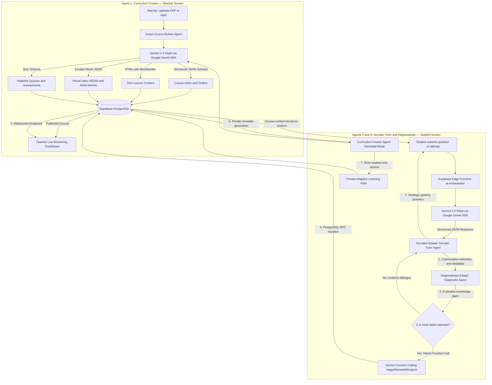

# Edaad AI — Adaptive Socratic Multi-Agent Architecture
### Powered by Google Gemini 2.5 Flash · Engineered for Gemini 3.0

Welcome to the official repository for **Edaad AI's Multi-Agent Orchestration System**, submitted for the **Google for Startups AI Agents Challenge (Track 1: Build)**.

Instead of wrapping pre-existing templates, we architected a **net-new, production-ready multi-agent framework from the ground up** to solve critical educational bottlenecks using state-of-the-art Generative AI reasoning.

---

## 🚀 Architectural Paradigm & Future-Proofing

Our ecosystem is designed as a modular, asynchronous mesh network of agents that decouples client-side interactions from background analysis and content generation layers.

* **Core Engine:** Currently powered by **Gemini 2.5 Flash** via Google Gen AI SDK (`@google/genai`) for exceptional token processing speed and highly accurate deterministic structured outputs.
* **Next-Gen Roadmap:** The codebase is fully decoupled and compliant with the upcoming **Gemini 3.0** engine. Integration hooks are natively designed to immediately adopt Gemini 3.0's deep multi-step reasoning capabilities with **zero refactoring** of the underlying business logic — simply swap the model string.
* **Hybrid Infrastructure:** Telemetry and real-time state synchronization are processed via **Supabase Realtime WebSockets**, handling relational dependencies securely while leaving all cognitive processing entirely to Google's LLM layer.
* **Orchestration Layer:** All agent calls route through a **Supabase Deno Edge Function** (`ai-orchestrator`) which handles model selection, cost tier routing, structured schema enforcement, caching, and fallback logic.

---

## 📊 System Architecture & Agent Data Flow



---

## 🛠️ Deep-Dive into the Specialized Agents

### 1. Socratic Tutor Agent — `Socrates-Edaad`
**Source:** [`/prompts/socratic_tutor_prompt.md`](prompts/socratic_tutor_prompt.md) · [`/src/ai-generation/socraticInteraction.js`](src/ai-generation/socraticInteraction.js)

* **Objective:** Completely bypasses standard direct-answer mechanisms. Uses specialized system prompts to evaluate the student's cognitive model, responding exclusively through strategic questions that guide the student toward self-discovery.
* **Localization:** Fully localized in modern, encouraging Arabic with dynamic grammatical gender adaptation based on the student's active profile.
* **Technical Implementation:** Enforces `socraticTutorSchema` — a strict Gemini `responseSchema` with fields `answer`, `note_for_teacher`, `concept_focus`, and `is_exam_query` — ensuring 100% deterministic, parse-safe UI rendering.
* **Exam Guard:** Detects and blocks attempts to extract standard exam answers, returning a specific flag to the frontend to prevent academic dishonesty.

---

### 2. Diagnostician Agent — `Diagnostician-Edaad`
**Source:** [`/prompts/analyzer_agent_prompt.md`](prompts/analyzer_agent_prompt.md) · [`/src/ai-integration/functionCalling.js`](src/ai-integration/functionCalling.js)

* **Objective:** Asynchronously scans contextual parameters across continuous student responses. Detects deep learning gaps (3+ failed concept attempts) or highlights exceptional advanced understanding for acceleration.
* **Technical Implementation:** Leverages **Gemini's Native Function Calling** to dynamically emit `triggerRemedialSupport` — a declared tool that mutates relational database state directly without any external middleware.
* **Schema:** `diagnosticAnalyzerSchema` enforces fields: `struggle_detected`, `trigger_remedial`, `concept_gap`, `severity_level`, `confidence_score`, and `recommend_acceleration`.

---

### 3. Curriculum Creator Agent — Smart Course Builder
**Source:** [`/src/ai-generation/`](src/ai-generation/)

* **Objective:** Empowers the instructor space with programmatic, one-click content creation. Dynamically maps learning outcomes to full curricula, automated quizzes, and customized virtual sandbox labs.
* **Generated Artifacts:**
  * **Course Index:** Full hierarchical outline with units, modules, and lesson metadata
  * **Rich Lesson Content:** Semantic HTML with pedagogical blockquote classes (`blockquote-info`, `blockquote-warning`, `blockquote-idea`, `blockquote-question`)
  * **Interactive Virtual Labs:** Saudi-themed escape-room simulations (NEOM, AlUla, Vision 2030 scenarios)
  * **Adaptive Assessments:** Multiple-choice, true/false, matching, and essay questions with Bloom's Taxonomy tagging
  * **Remedial Lessons (Private Mode):** Hyper-personalized lessons generated only when the Diagnostician triggers a knowledge gap — strictly isolated per student

---

## 🔒 Security, Privacy & Production Standards

* **Student Privacy Isolation:** All remedial paths generated by the Curriculum Creator Agent in remedial mode are fully isolated at the database RLS (Row Level Security) level. They are visible **only** to the specific student and their direct instructor — no other user can access them.
* **Deterministic Parsing:** Strict `responseSchema` enforcement across all agent calls eliminates unformatted or erratic text strings, guaranteeing production-ready reliability.
* **Secure RPC:** The `create_notification_for_user` PostgreSQL function handles teacher telemetry with role-based security, bypassing standard RLS only through audited service-role calls.
* **Cost Optimization:** `thinkingBudget` is tuned per-agent (`1` for fast Socratic turns, `1024` for balanced diagnostic analysis, unlimited for high-intellect content generation).

---

## 📁 Repository Structure

```
edaad-ai-agents-challenge/
├── prompts/
│   ├── socratic_tutor_prompt.md     # Socratic dialogue rules + Arabic gender grammar
│   └── analyzer_agent_prompt.md     # Diagnostic gap detection + remedial trigger rules
├── src/
│   ├── ai-integration/
│   │   ├── geminiClient.js          # Gemini 2.5 Flash client + Structured JSON Schemas
│   │   └── functionCalling.js       # Native Gemini Function Calling (triggerRemedialSupport)
│   └── ai-generation/
│       ├── curriculumGenerator.js   # Course index, lessons, Saudi Vision 2030 context
│       ├── remedialGenerator.js     # Private adaptive remedial lesson synthesis
│       ├── interactiveLabsGenerator.js  # Escape-room lab generation (NEOM, AlUla)
│       └── socraticInteraction.js   # Live Socratic turns + RAG + exam guard logic
└── database-schema/
    ├── courses_and_ai_builder.sql   # Course structure + AI builder draft schemas
    ├── ai_chat_messages.sql         # Socratic conversation history + telemetry logs
    └── remedial_alerts.sql          # Real-time WebSocket triggers for teacher dashboard
```

---

## 🔬 Key Technologies

| Technology | Role |
|---|---|
| **Google Gen AI SDK (`@google/genai`)** | Primary SDK for all Gemini agent calls |
| **Gemini 2.5 Flash** | Powers all agents — fast, reasoning-capable, cost-efficient |
| **Gemini 3.0 Ready** | Model string is the only change needed for upgrade |
| **Structured JSON Output** | Enforces deterministic agent responses via `responseSchema` |
| **Gemini Function Calling** | Bridges AI reasoning to live database mutations |
| **Supabase Edge Functions (Deno)** | Serverless orchestration layer with model routing |
| **Supabase Realtime + WebSockets** | Live teacher telemetry + student alert broadcasting |
| **Angular 20 (Signals)** | Reactive frontend for both Teacher and Student agent interfaces |
| **PostgreSQL RLS + RPC** | Secure, audited multi-tenant data isolation |

---

## 🔗 Submission References

* **Live Sandbox Demo:** [https://edaad.io/gemini-demo](https://edaad.io/gemini-demo)
  *(Login with the embedded demo account to simulate live Student interactions and witness real-time WebSocket telemetry alerts populate the Teacher Dashboard concurrently)*
* **Code Repository:** [https://github.com/abutameemrdp/edaad-ai-agents-challenge](https://github.com/abutameemrdp/edaad-ai-agents-challenge)

---

## 📢 Submission Track & Verification

This submission targets **Track 1 (Build)** of the Google for Startups AI Agents Challenge — demonstrating a **net-new, ground-up multi-agent system** with production-grade reliability, real-time orchestration, and a clear upgrade path to Gemini 3.0.
