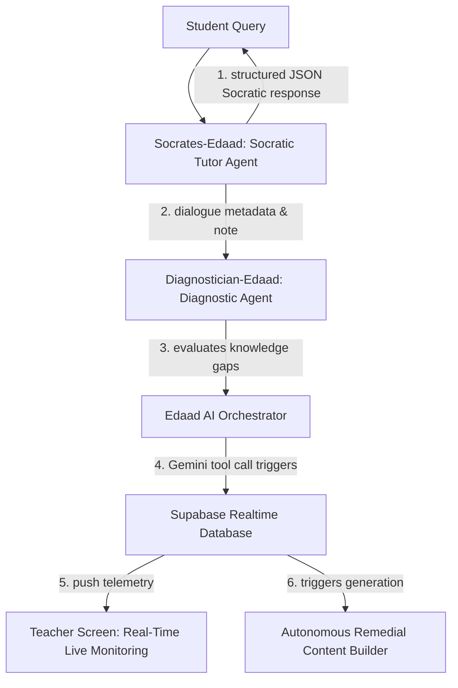

# Socrates & Diagnostician Multi-Agent System 🚀🤖✨
### *Edaad AI Ecosystem submission for Google for Startups AI Agents Challenge*

Welcome to the official repository of **Edaad AI Agents System** designed for the **Google for Startups AI Agents Challenge**.

Edaad AI leverages Google's state-of-the-art **Gemini API** and **Vertex AI** capabilities to build a production-grade, highly reliable **Multi-Agent Educational System**. This system coordinates multiple intelligent agents to deliver real-time personalized Socratic tutoring, continuous cognitive diagnosis, and autonomous remedial course generation for students, with a live telemetry dashboard for teachers.

---

## 🎨 Core Architecture (The Multi-Agent Core)

Our implementation models two main cooperative agents using the **Vertex AI Agent Development Kit (ADK)** logic:

### 🧠 Deep-Reasoning Pedagogical Agents
Edaad's agents are not simple instruction-following UI scripts; they are **deep-reasoning pedagogical agents** with cognitive intelligence. They analyze the structural and conceptual relationships in curricula deeply, diagnosing precisely where a student struggles, and adapt training materials dynamically to align with the student's unique learning curve.

### 👥 Sandbox Screens & Agent Responsibilities

#### 1. Teacher Dashboard (The Curriculum Creator Agent)
* **Smart Course Builder Agent**: Operates in the Teacher view. It acts as a highly advanced content creation agent that autonomously synthesizes comprehensive training curricula, course structures, lesson outlines, Saudi-themed scientific escape-room virtual simulation labs (e.g. Al-Ula, NEOM), case studies, and interactive quizzes. Reviewers can experience the full capabilities of this core agent inside Edaad's main Course Builder workspace.

#### 2. Student Dashboard (Socratic Tutor & Gap Diagnostician Agents)
* **Socrates-Edaad (Socratic Tutor Agent)**: Active in the Student interface. This agent never directly provides the answers. Instead, it leads the student in progressive, single-concept inquiries using modern Socratic dialogue rules to encourage independent thinking and self-guided discovery.
  * *Localization*: Fully localized in modern, encouraging Arabic, dynamically adapting pronouns and grammatical gender based on the student's active profile.
  * *Source*: [`/prompts/socratic_tutor_prompt.md`](prompts/socratic_tutor_prompt.md)
* **Diagnostician-Edaad (Gap Diagnostician Agent)**: Runs continuously behind the scenes, monitoring the Student-Socrates chat history. If a student struggles (reaches 3+ unsuccessful understanding attempts on a specific topic milestone), the Diagnostician automatically triggers a Gemini Tool Call to compile a **hyper-personalized, adaptive Remedial Lesson**.
  * 🔒 *Strict Student Privacy*: Remedial lessons are created dynamically for the specific student only. They are strictly confidential, mapped directly to their student profile, and **no other student in the course can view or access them**.
  * 🔔 *Real-time Telemetry & Alerts*: Once the private remedial lesson is generated, the agent fires a secure PostgreSQL RPC and WebSocket broadcast, instantly alerting the Teacher's monitoring dashboard with the student's name, concept gap, and a direct review link so the teacher can monitor and support their progress.
  * *Source*: [`/prompts/analyzer_agent_prompt.md`](prompts/analyzer_agent_prompt.md)

---

## 📂 Repository Structure

* **`/prompts`**: Contains the precise educational system instructions.
  * [`socratic_tutor_prompt.md`](prompts/socratic_tutor_prompt.md) - Deep Socratic Dialogue Rules & Arabic Gender Grammar rules.
  * [`analyzer_agent_prompt.md`](prompts/analyzer_agent_prompt.md) - Cognitive Gap Diagnostician & Remedial triggers rules.
* **`/src/ai-integration`**: Direct connection and orchestration models.
  * [`geminiClient.js`](src/ai-integration/geminiClient.js) - Vertex AI connection utilizing Google Gen AI SDK and strict Structured JSON Schemas.
  * [`functionCalling.js`](src/ai-integration/functionCalling.js) - Demonstrates Gemini Native Function Calling (Tools) triggered dynamically to execute remedial notifications.
* **`/src/ai-generation`**: Comprehensive generation engines utilized by Edaad's Multi-Agent layer.
  * [`curriculumGenerator.js`](src/ai-generation/curriculumGenerator.js) - Generates course indices, syllabi, and structures aligned with Saudi Vision 2030 values.
  * [`remedialGenerator.js`](src/ai-generation/remedialGenerator.js) - Synthesizes friendly Arabic HTML remedial courses and check-for-understanding assessments.
  * [`interactiveLabsGenerator.js`](src/ai-generation/interactiveLabsGenerator.js) - Generates Saudi-themed virtual escape room learning scenarios (NEOM, Al-Ula).
  * [`socraticInteraction.js`](src/ai-generation/socraticInteraction.js) - Handles live student interactions, including RAG text reference lookups, exam inhibition, and gender pronoun rules.
* **`/database-schema`**: Real-time database schemas and triggers showing how the AI Agents persist and sync state in production.
  * [`courses_and_ai_builder.sql`](database-schema/courses_and_ai_builder.sql) - Database schemas for courses, modules, and AI Generator drafts.
  * [`ai_chat_messages.sql`](database-schema/ai_chat_messages.sql) - Persistent chat log storage for Socrates dialogue history.
  * [`remedial_alerts.sql`](database-schema/remedial_alerts.sql) - Real-time Supabase telemetry and replication alerts triggered by the Diagnostic agent to notify the teacher's UI instantly via WebSocket.

---

## 🚀 Key Technologies Used

1. **Gemini 2.0 Flash**: Powers real-time low-latency chat interactions, diagnostic analysis, and structured course module JSON generations.
2. **Structured JSON Output**: Ensures 100% deterministic parsing in production systems, utilizing Google's schema restrictions.
3. **Gemini Tool Calls (Function Calling)**: Seamlessly integrates AI reasoning with database operations, bridging the gap between natural language interaction and system execution.
4. **Supabase Realtime & WebSockets**: Enables instant, secure, real-time synchronization between student diagnostic results and the teacher's monitoring dashboard.

---

## 🔔 Real-Time Teacher Notification Workflow

When **Socrates-Edaad** diagnoses a conceptual struggle and triggers a remedial support event, Edaad AI executes a highly secure PostgreSQL RPC function `create_notification_for_user`. This triggers a real-time WebSocket broadcast to the teacher's active dashboard, rendering a high-visibility toast banner:

1. **Struggle Diagnosis**: Behind the scenes, the Diagnostic Agent flags a knowledge gap.
2. **Remedial Generation**: A personalized HTML remedial lesson skeleton is constructed and saved in the database.
3. **Secure RPC Execution**: The system calls `create_notification_for_user` to bypass standard RLS restrictions in a secure, audited manner.
4. **Real-time Live Sync**: Supabase publishes the record insertion via the `user_notifications` WebSocket channel.
5. **Dashboard Toast**: The teacher's split-screen browser listener intercept triggers `showRemedialNotification = true`, instantly alerting them with the student's name, struggle concept, and course name.

---

## 📢 Submission Verification & Guidelines
This codebase is optimized for **Track 2 (Optimizing Multi-Step Reasoning)** of the Google for Startups AI Agents Challenge, converting a basic Socratic prototype into a highly secure, reliable, production-ready system.

* **Live Demo URL**: [https://edaad.io/gemini-demo](https://edaad.io/gemini-demo) (Live interactive split-screen sandbox)
* **Code Repository**: [https://github.com/abutameemrdp/edaad-ai-agents-challenge](https://github.com/abutameemrdp/edaad-ai-agents-challenge) (GitHub Repository)
